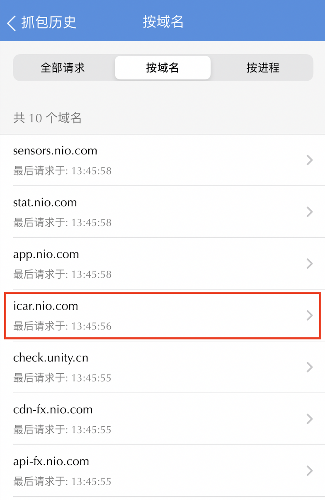
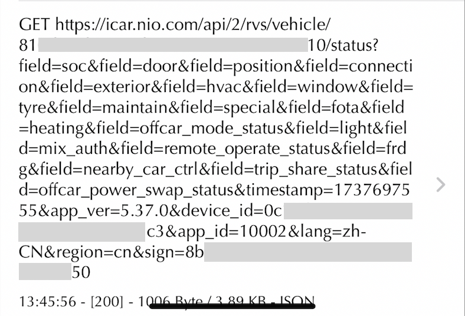
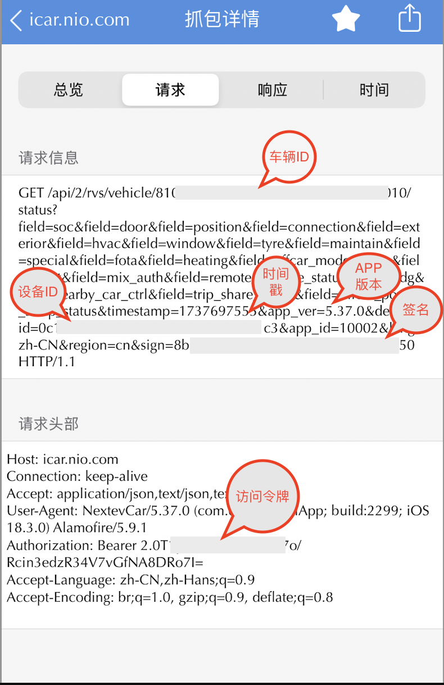

# NIO Vehicle 集成

这个Home Assistant自定义集成组件可以让你在Home Assistant中查看你的蔚来汽车。

## 功能

- 显示车辆基本信息（电量、里程等）
- 显示车辆位置信息
- 支持多种传感器数据
- 支持车辆追踪

## 安装方式

### 方式一：通过HACS安装（推荐）

1. 确保已经安装了[HACS](https://hacs.xyz/)
2. 在HACS中点击"集成"
3. 点击右上角的"+"按钮
4. 搜索"NIO Vehicle"
5. 点击"下载"
6. 重启Home Assistant

### 方式二：手动安装

1. 下载此仓库的最新版本
2. 将`nio_vehicle`文件夹复制到你的`custom_components`文件夹中
3. 重启Home Assistant

## 配置说明

1. 进入Home Assistant配置界面
2. 点击"集成"
3. 点击右下角的"+"按钮添加集成
4. 搜索"NIO Vehicle"
5. 按照提示输入你的车辆ID，访问令牌，设备ID以及签名和时间戳等信息（具体获取方式见：获取车辆通信数据包）

## 支持的功能

- 电池电量
- 续航里程
- 车辆位置
- 车辆状态
- 充电状态
- 车门状态
- 空调状态

## 问题反馈

如果你在使用过程中遇到任何问题，请在GitHub上提交Issue。

## 获取车辆通信数据包
IOS 客户端操作
1. 通过APP Store 安装抓包工具 Stream
2. 进入Stream "HTTPS 抓包" 抓包设置项，按照提示安装证书
3. 再Stream 中点击 "开始抓包" 选项，这时候 会建立一个 IOS 的VPN 连接
4. 打开 "蔚来" APP，点击进入 "爱车"选项
5. 再次进入Stream 点击"停止抓包"
6. 再Stream中 选择 "历史抓包"
7. 在历史抓包记录中按照域名归类，找到icar.nio.com 记录，类似下图的记录：

8. 进入请求列表再找到如下类似记录

9. 进入请求详情，按照图示获取对应的车辆添加初始化所需的信息，特别注意这里填写访问令牌时 不要包含 Bearer

## 版权和许可

本项目采用MIT许可证。
